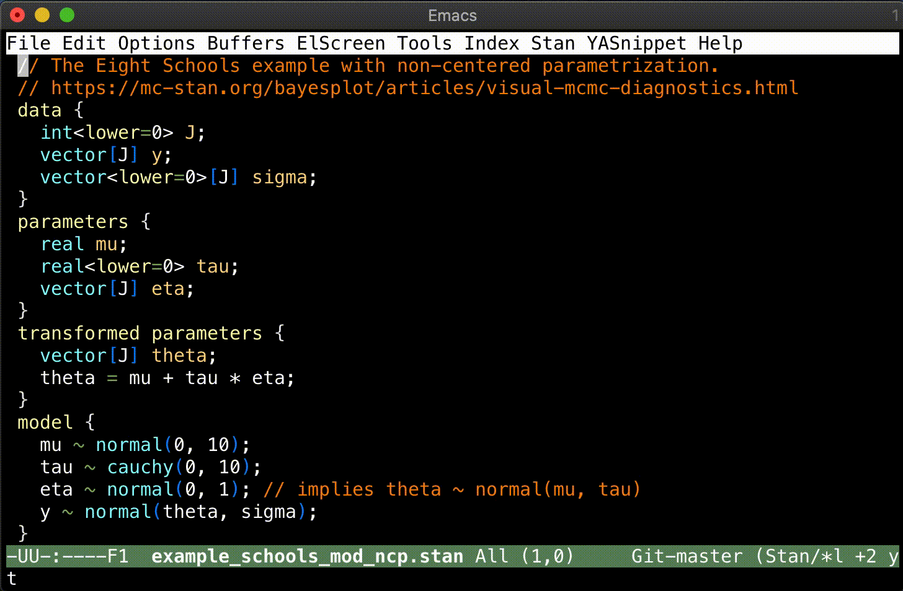

# Emacs support for Stan

[](https://travis-ci.org/stan-dev/stan-mode)
[](COPYING)

<!-- https://engineering.giphy.com/how-to-make-gifs-with-ffmpeg/ -->


## NEWS

- 2021-01-30 Version 10.2.1 bugfix for https://github.com/stan-dev/stan-mode/issues/64
- 2020-08-30 Version 10.2.0 update for Stan version 2.24


## Packages and tools included

This repository contains several Emacs packages and tools to make editing [Stan](https://mc-stan.org) files easier. For information on Stan itself, see its [documentation](https://mc-stan.org/users/documentation/) and [example models](https://github.com/stan-dev/example-models).

- [`stan-mode`](https://github.com/stan-dev/stan-mode/tree/master/stan-mode) is a major mode for editing Stan files. Its current features include:
  - syntax highlighting
  - indentation
  - [imenu](http://www.emacswiki.org/emacs/ImenuMode) support for blocks, variables, and user-defined functions.

- [`company-stan`](https://github.com/stan-dev/stan-mode/tree/master/company-stan): Adds a [`company-mode`](https://company-mode.github.io) completion backend.

- [`eldoc-stan`](https://github.com/stan-dev/stan-mode/tree/master/eldoc-stan): Adds Stan support for the [`eldoc`](https://www.emacswiki.org/emacs/ElDoc) minor mode, which show the argument list of the function being written.

- [`flycheck-stan`](https://github.com/stan-dev/stan-mode/tree/master/flycheck-stan) adds a [`flycheck`](https://www.flycheck.org/en/latest/) on-the-fly syntax checker.

- [`stan-snippets`](https://github.com/stan-dev/stan-mode/tree/master/stan-snippets): Adds Stan support for [yasnippet](https://github.com/capitaomorte/yasnippet). Yasnippet is a template system for Emacs. Snippets are defined for blocks, control structures, and *all* the built-in functions and distributions.

- [`ac-stan`](https://github.com/stan-dev/stan-mode/tree/master/ac-stan): Adds a [`auto-complete`](https://github.com/auto-complete/auto-complete) stan dictionary. This is not on MELPA because `auto-complete` itself is semi-deprecated.

- [`indent-stan-files`](https://github.com/stan-dev/stan-mode/tree/master/indent-stan-files): A shell script that uses `stan-mode` to indent a file.

- [`stan-language-definitions`](https://github.com/jrnold/stan-language-definitions): The file [`stan_lang.json`](https://github.com/jrnold/stan-language-definitions/blob/master/stan_lang.json) contains all keywords, functions (with their signatures and documentation) in the Stan modeling language. This is used to generate the keyword lists and snippets used by the modes. It could also be useful for developers designing tools for Stan, e.g. other editor modes.


## Installing

Example configurations are available in the package-specific README.md file under each subfolder (linked above).

### Via package.el

The recommended way to install these packages is using the built-in package manager: `package.el`.
These packages are available from [MELPA](http://melpa.org).
If you're not already using MELPA, follow its installation [instructions](http://melpa.org/#/getting-started).

You can then install the packages using the following commands:

<kbd>M-x package-install [RET] stan-mode [RET]</kbd><br>
<kbd>M-x package-install [RET] company-stan [RET]</kbd><br>
<kbd>M-x package-install [RET] eldoc-stan [RET]</kbd><br>
<kbd>M-x package-install [RET] flycheck-stan [RET]</kbd><br>
<kbd>M-x package-install [RET] stan-snippets [RET]</kbd><br>

If the installation does not work, try refreshing the package list:

<kbd>M-x package-refresh-contents [RET]</kbd>

Or add the following to your `init.el` to ensure installation of these packages:
```lisp
(package-refresh-contents)
(mapc
 (lambda (p)
   (unless (package-installed-p p)
     (package-install p)))
 '(stan-mode
   company-stan
   eldoc-stan
   flycheck-stan
   stan-snippets))
```

### Via Cask

Another way to manage dependencies is to to use [Cask](https://github.com/cask/cask).
See its [docs](http://cask.readthedocs.org/en/latest/guide/introduction.html#emacs-configuration) for an argument as to why to use Cask to manage your configuration.

Simply add the following to your configuration Cask file:
```lisp
(source melpa)
(depends-on "stan-mode")
(depends-on "company-stan")
(depends-on "eldoc-stan")
(depends-on "flycheck-stan")
(depends-on "stan-snippets")
```
and from the command line in the same directory as the Cask file use `cask` to install the packages,
```console
$ cask install
```
See the Cask [documentation](http://cask.readthedocs.org/en/latest/index.html) for more information.


### Via Github
The package maintainer's current development version is available on Github. This can be cloned as follows. You can also use `--recurse-submodules`, but this will recurse more than one level, which is not necessary for our purpose.

```console
# Clone the develop branch. Change as appropriate.
$ git clone --branch=develop https://github.com/stan-dev/stan-mode.git
$ cd stan-mode
# Clone submodules
$ git submodule update --init -- stan-language-definitions
$ git submodule update --init -- local-melpa
$ git submodule update --init -- rstanarm
# To run automated tests, do the following.
make clean; make all
# If just installing, do the following.
make local-melpa
```

Add the following to your `init.el`. The local development versions will be installed provided their version numbers are greater than the ones in MELPA.

```lisp
;; To make the local package archive visible.
(let ((local-melpa-stan
       "your-path/stan-mode/local-melpa/packages"))
  (when (file-exists-p local-melpa-stan)
    (add-to-list 'package-archives
                 `("local-melpa-stan" . ,local-melpa-stan) t)))
;; Installation
(package-refresh-contents)
(mapc
 (lambda (p)
   (unless (package-installed-p p)
     (package-install p)))
 '(stan-mode
   company-stan
   eldoc-stan
   flycheck-stan
   stan-snippets
   ;; If you use auto-complete, uncomment the line below.
   ;; ac-stan
   ))
```


## Configuration
The recommended mode of configuration is via the `use-package`. One example of configuration is included below. Please the package-specific README files for configuration without use-package.

```lisp
;; Uncomment the line below if not required elsewhere.
;; (require 'use-package)

;;; stan-mode.el
(use-package stan-mode
  :mode ("\\.stan\\'" . stan-mode)
  :hook (stan-mode . stan-mode-setup)
  ;;
  :config
  ;; The officially recommended offset is 2.
  (setq stan-indentation-offset 2))

;;; company-stan.el
(use-package company-stan
  :hook (stan-mode . company-stan-setup)
  ;;
  :config
  ;; Whether to use fuzzy matching in `company-stan'
  (setq company-stan-fuzzy nil))

;;; eldoc-stan.el
(use-package eldoc-stan
  :hook (stan-mode . eldoc-stan-setup)
  ;;
  :config
  ;; No configuration options as of now.
  )

;;; flycheck-stan.el
(use-package flycheck-stan
  ;; Add a hook to setup `flycheck-stan' upon `stan-mode' entry
  :hook ((stan-mode . flycheck-stan-stanc2-setup)
         (stan-mode . flycheck-stan-stanc3-setup))
  :config
  ;; A string containing the name or the path of the stanc2 executable
  ;; If nil, defaults to `stanc2'
  (setq flycheck-stanc-executable nil)
  ;; A string containing the name or the path of the stanc2 executable
  ;; If nil, defaults to `stanc3'
  (setq flycheck-stanc3-executable nil))

;;; stan-snippets.el
(use-package stan-snippets
  :hook (stan-mode . stan-snippets-initialize)
  ;;
  :config
  ;; No configuration options as of now.
  )

;;; ac-stan.el (Not on MELPA; Need manual installation)
(use-package ac-stan
  :load-path "path-to-your-directory/ac-stan/"
  ;; Delete the line below if using.
  :disabled t
  :hook (stan-mode . stan-ac-mode-setup)
  ;;
  :config
  ;; No configuration options as of now.
  )
```


## For developers
### Updating packages for a new Stan version

To update stan-mode when a new version of the Stan language comes out:

1. Replace `stan-lang/stan-functions-MAJORVERSION_MINORVERSION.txt` with the newest version generated by `extract_function_sigs.py` in the [stan-dev/docs repo](https://github.com/stan-dev/docs). The version string must exist in the file name and it is the Stan version.
2. Clean and rebuild all generated files. Fix issues in testing and linting as necessary.
``` shell
$ make clean
$ make all
```
3. Save and commit the changes.
4. Bump the version number of the emacs packages. For example, to bump to 10.0.0. This is the emacs stan-mode package version, which is different than the Stan language version.

``` shell
$ ./update-versions.sh 10.0.0
```

5. If the changes are minor, tag the commit and push the tag for MELPA Stable. If making major changes, it is better to create a pull request on Github to document and discuss.

``` shell
$ git tag v10.0.0
$ git push --tags
```

### Emacs lisp good practices
The packages must meet the MELPA standards. See ["Making your package ready for inclusion"](https://github.com/melpa/melpa/blob/master/CONTRIBUTING.org#making-your-package-ready-for-inclusion). The packages ensure these standards through the following automated examinations, which are mandated in `make all`.

- Testing via [buttercup](https://github.com/jorgenschaefer/emacs-buttercup)
- Linting
  - Package metadata via [package-lint](https://github.com/purcell/package-lint)
  - Emacs lisp code via [elisp-lint](https://github.com/gonewest818/elisp-lint)

For testing only, use `make test` at the top-level or in a subfolder. For linting only, use `make lint` at the top-level (both types) or `make lint-package` and `make lint-elisp` in a subfolder.

### Available top-level make commands

The following make commands are available at the top-level `Makefile`. Each package has its own `Makefile` and common included file `common.mk`, allowing us to work on them individually.

| Command        | Cleaning Equivalent | Action                                                                            |
|----------------|---------------------|-----------------------------------------------------------------------------------|
| `all`          | `clean`             | Run `stan-lang` `deps` `build-src` `local-melpa` `compile` `test` `lint`          |
|                |                     |                                                                                   |
| `stan-lang`    | `clean-stan-lang`   | Create the `stan-lang.json` definition file in `stan-language-definitions`.       |
| `deps`         | `clean-deps`        | Run `cask install` for each package to manage dependencies.                       |
| `build-src`    | `clean-src`         | Build data files for each package.                                                |
| `local-melpa`  | `clean-local-melpa` | Create a local archive `local-melpa` to manage package installability in testing. |
| `compile`      | `clean-elc`         | Byte-compile `*.elc` files for each package.                                      |
| `test`         |                     | Run `buttercup.el` tests for each package.                                        |
| `lint`         |                     | Run both linting for each package.                                                |
| `lint-package` |                     | Run `package-lint.el` to examine package metadata.                                |
| `lint-elisp`   |                     | Run `elisp-lint.el` to examine elisp coding practice.                             |
| `dist`         | `clean-dist`        | Run `cask package` to build package files under `dist` for each package.          |
| `show`         |                     | Show elisp files designated for byte-compilation for each package.                |
| `snippets`     | `clean-snippets`    | Move snippet files under `stan-snippets/snippets/` to `snippets`                  |


### Submodules
- [`stan-language-definitions`](https://github.com/jrnold/stan-language-definitions): Provides language definitions. All packages depend on this for definitions.
- [`local-melpa`](https://github.com/kaz-yos/melpa/tree/local-melpa-stan): Provides a local version of MELPA to make the current development version available via the `package.el` interface. Used to avoid installability issue during linting. Also allows package installation checking.
- [`rstanarm`](https://github.com/kaz-yos/rstanarm): Used to provide examples of complicated stan code in indentation and syntax highlighting tests for the `stan-mode` package.


### TODO items
- eldoc-stan: Correctly ignore , in [,]
- flycheck-stan: Handle end of column
- company-stan: Detect context and modify candidates

## License

All packages are free software under the [GPL v3](http://www.gnu.org/licenses/gpl-3.0.html).

<!--  LocalWords:  stan imenu yasnippet flymake MELPA kbd RET init '
 -->
<!--  LocalWords:  mapc EmacsWiki cd 'load 'stan 'flymake Aquamacs
 -->
<!--  LocalWords:  GPL stanc ' 'load 'stan autocomplete setq 'flymake
 -->
<!--  LocalWords:  lang json el emacs CmdStan flycheck 'stan v3
 -->
<!--  LocalWords:  'ac 'flycheck v1
 -->
