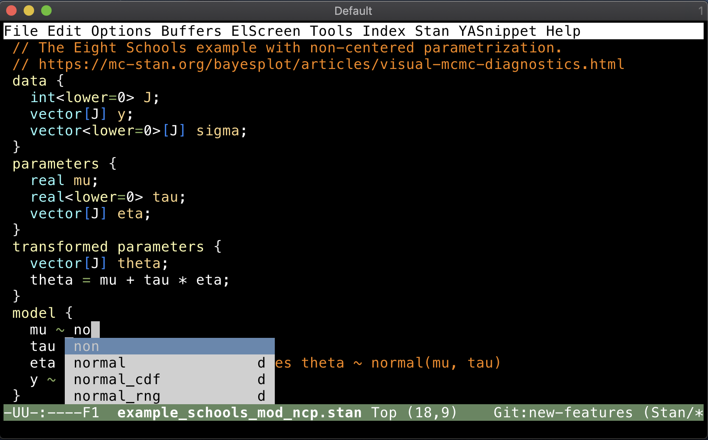

# auto-complete support for Stan



`ac-stan` adds a dictionary for the [`auto-complete`](https://github.com/auto-complete/auto-complete) mode covering [Stan](https://mc-stan.org) function names. Please note that the `auto-complete` mode has been archived and not under active development.


## Installation
Install this package using the built-in package manager: `package.el`. `ac-stan` is available from [MELPA](http://melpa.org). If you're not already using MELPA, follow its [installation instructions](http://melpa.org/#/getting-started).

You can then install it using the following command:

<kbd>M-x package-install [RET] ac-stan [RET]</kbd>


## Configuration
An example configuration using the [`use-package`](https://github.com/jwiegley/use-package) macro is the following.

```{lisp}
(use-package ac-stan
  ;; Add a hook to setup `ac-stan' upon `stan-mode' entry
  :hook (stan-mode . ac-stan-ac-mode-setup))
```

It can also be written as follows.

```{lisp}
(require 'ac-stan)
;; Add a hook to setup `ac-stan' upon `stan-mode' entry
(add-hook 'stan-mode-hook 'ac-stan-ac-mode-setup)
```

## Inner workings
The `ac-dict/stan-mode` file is the dictionary file containing keywords in Stan.
