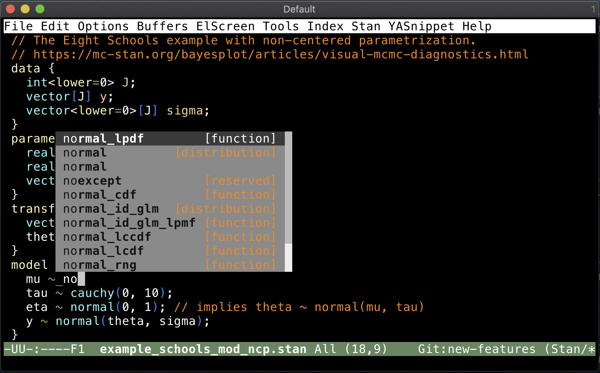

# company-mode completion backend for Stan



`company-stan` adds a [`company-mode`](https://company-mode.github.io) backend for completing [Stan](https://mc-stan.org) function names.


## Installation
Install this package using the built-in package manager: `package.el`. `company-stan` is available from [MELPA](http://melpa.org). If you're not already using MELPA, follow its [installation instructions](http://melpa.org/#/getting-started).

You can then install it using the following command:

<kbd>M-x package-install [RET] company-stan [RET]</kbd>


## Configuration
An example configuration using the [`use-package`](https://github.com/jwiegley/use-package) macro is the following.

```{lisp}
(use-package company-stan
  ;; Add a hook to setup `company-stan' upon `stan-mode' entry
  :hook (stan-mode . company-stan-setup)
  ;;
  :config
  ;; Whether to use fuzzy matching in `company-stan'
  (setq company-stan-fuzzy nil))
```

It can also be written as follows.

```{lisp}
(require 'company-stan)
;; Whether to use fuzzy matching in `company-stan'
(setq company-stan-fuzzy nil)
;; Add a hook to setup `company-stan' upon `stan-mode' entry
(add-hook 'stan-mode-hook 'company-stan-setup)
```

## Inner workings
`company-stan-setup` will add the `company-stan-backend` (keyword completion) and the `company-dabbrev-code` (part of `company-mode`; completion for in-buffer symbols) to the [`company-backends`](https://github.com/company-mode/company-mode/wiki/Writing-backends) buffer locally. These are used as a [grouped backend](https://github.com/company-mode/company-mode/blob/master/company.el#L433-L449) for better user experience. `company-stan-backend` uses the [keyword list](https://github.com/stan-dev/stan-mode/blob/master/stan-mode/stan-keywords-lists.el) in `stan-mode` as the completion source.

These blog posts were hugely helpful in development.
- [Writing the Simplest Emacs company-mode Backend](http://sixty-north.com/blog/writing-the-simplest-emacs-company-mode-backend.html)
- [A More Full-Featured Emacs company-mode Backend](http://sixty-north.com/blog/a-more-full-featured-company-mode-backend.html)
