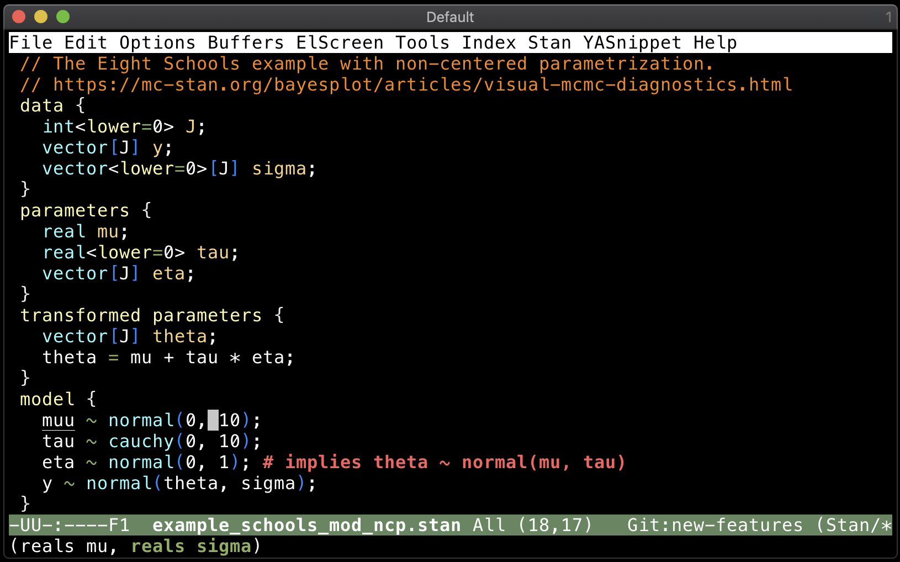

# eldoc for Stan



`eldoc-stan` adds a [`eldoc-mode`](https://www.emacswiki.org/emacs/ElDoc) support for [Stan](https://mc-stan.org) function arguments.


## Installation
Install this package using the built-in package manager: `package.el`. `eldoc-stan` is available from [MELPA](https://melpa.org). If you're not already using MELPA, follow its [installation instructions](https://melpa.org/#/getting-started).

You can then install it using the following command:

<kbd>M-x package-install [RET] eldoc-stan [RET]</kbd>


## Configuration
An example configuration using the [`use-package`](https://github.com/jwiegley/use-package) macro is the following.

```{lisp}
(use-package eldoc-stan
  ;; Add a hook to setup `eldoc-stan' upon `stan-mode' entry
  :hook (stan-mode . eldoc-stan-setup))
```

It can also be written as follows.

```{lisp}
(require 'eldoc-stan)
;; Add a hook to setup `eldoc-stan' upon `stan-mode' entry
(add-hook 'stan-mode-hook 'eldoc-stan-setup)
```

## Inner workings
The package was designed after [`c-eldoc`](https://github.com/nflath/c-eldoc). `eldoc-stan-setup` will buffer locally set the [`eldoc-documentation-function`](https://doc.endlessparentheses.com/Var/eldoc-documentation-function.html) variable to `eldoc-stan-eldoc-documentation-function` and turn on `eldoc-mode`. The `eldoc-stan-eldoc-documentation-function` function retrieves argument information on the current function from the `eldoc-stan--hash-table`. This hash table is populated at package loading by entries in the `eldoc-stan.json` JSON file included in the package. This JSON file is a trimmed-down version of [`stan_lang.json`](https://github.com/jrnold/stan-language-definitions/blob/master/stan_lang.json) created with functions defined in `create-eldoc-stan-json.el`.
