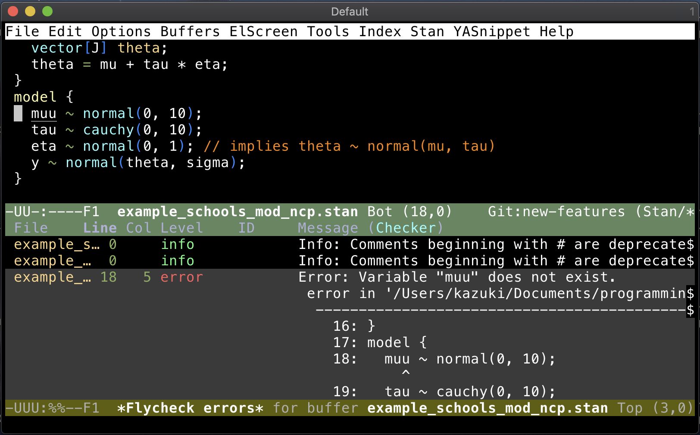

# flycheck syntax checker for Stan



`flycheck-stan` adds a [`flycheck`](https://www.flycheck.org/en/latest/) syntax checker for [Stan](https://mc-stan.org) program.


## Installation
### Emacs package
Install this package using the built-in package manager: `package.el`. `flycheck-stan` is available from [MELPA](http://melpa.org). If you're not already using MELPA, follow its [installation instructions](http://melpa.org/#/getting-started).

You can then install it using the following command:

<kbd>M-x package-install [RET] flycheck-stan [RET]</kbd>

### stanc
This package requires an external software, the `stanc` binary, which is a part of the [`CmdStan`](https://github.com/stan-dev/cmdstan). `stanc` translates a stan file into a c++ file which can then be compiled into an executable.

`CmdStan` has to be installed from the source code as of August 2019. See [Getting Started with CmdStan](https://github.com/stan-dev/cmdstan/wiki/Getting-Started-with-CmdStan). It proceed as follows, but the directory names are specific to your environment.

```{shell}
## Move to an appropriate directory for source code download
cd ~/source_code/
## Clone the source code repo
git clone https://github.com/stan-dev/cmdstan.git --recursive
## Move in
cd cmdstan
## Build all tools
make build
## Make stanc accessible via a symbolic link
ln -s ./bin/stanc /usr/local/bin/stanc
```


## Configuration
An example configuration using the [`use-package`](https://github.com/jwiegley/use-package) macro is the following.

```{lisp}
;; flycheck
(use-package flycheck
  :config
  ;; Uncomment the line below if you want to enable it everywhere.
  ;;(global-flycheck-mode +1)
  )

;; flycheck-stan
(use-package flycheck-stan
  ;; Add a hook to setup `flycheck-stan' upon `stan-mode' entry
  :hook (stan-mode . flycheck-stan-setup))
```

It can also be written as follows.

```{lisp}
;; flycheck
(require 'flycheck)
(global-flycheck-mode +1)

;; flycheck-stan
(require 'flycheck-stan)
;; Add a hook to setup `flycheck-stan' upon `stan-mode' entry
(add-hook 'stan-mode-hook flycheck-stan-setup)
```


## flycheck installation verification

After the initial installation, use [M-x flycheck-verify-setup](https://www.flycheck.org/en/latest/user/troubleshooting.html#verify-your-setup) to check the configuration.

For macOS, see also [Flycheck can’t find any programs in GUI Emacs on MacOS](https://www.flycheck.org/en/latest/user/troubleshooting.html#flycheck-cant-find-any-programs-in-gui-emacs-on-macos).


## flycheck interaction

See [Flycheck Quickstart](https://www.flycheck.org/en/latest/user/quickstart.html).

The syntax check should be automatic.

| flycheck command            | Action                                                |
|-----------------------------|-------------------------------------------------------|
| `M-x flycheck-verify-setup` | Check if the `stanc` checker is appropriately set up. |
| `M-x flycheck-compile`      | Run the `stanc` command on the current stan program.  |
|                             |                                                       |


## Inner workings
`flycheck-stan-setup` will add the `stanc` checker to the global value of the `flycheck-checkers` list. Note this checker is only active in a `stan-mode` buffer.

The most important part of the checker definition is creating the pattern matchers. `flycheck` uses extended `rx` notations for regular expression. Being able to use this notation directly in the `M-x re-builder` is nice. The following hack through the `reb-mode-hook` allows this.

```{lisp}
(use-package flycheck
  :commands (flycheck-enhance-rx-buffer-locally)
  :hook (reb-mode . flycheck-enhance-rx-buffer-locally)
  :config
  ;;
  (defun flycheck-enhance-rx-buffer-locally ()
    "Enhances `rx' buffer locally with `flycheck' elements.

`flycheck' adds keywords `line', `column', `file-name',
`message', and `id' to `rx-constituents' defined in `rx.el'
to handle error message parsing.

This function is intended for `re-builder'."
    (setq-local rx-constituents
                (append
                 `((line . ,(rx (group-n 2 (one-or-more digit))))
                   (column . ,(rx (group-n 3 (one-or-more digit))))
                   (file-name flycheck-rx-file-name 0 nil)
                   (message flycheck-rx-message 0 nil)
                   (id flycheck-rx-id 0 nil))
                 rx-constituents nil)))
  ;; Delay in seconds before displaying errors at point.
  (setq flycheck-display-errors-delay 0.9)
  ;;
  ;; Enable everywhere
  (global-flycheck-mode +1))
```


References:

- [Flycheck Developer’s Guide](https://www.flycheck.org/en/latest/developer/developing.html)
