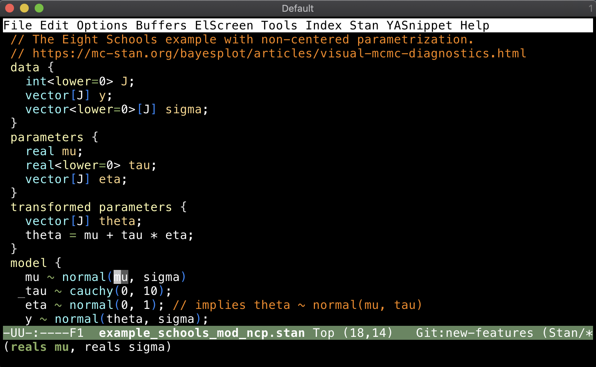

# Yasnippets for Stan

[](http://melpa.org/#/stan-snippets)
[](http://stable.melpa.org/#/stan-snippets)



`stan-snippets` adds Stan support for [yasnippet](https://github.com/capitaomorte/yasnippet). Yasnippet is a template system for Emacs. Snippets are defined for blocks, control structures, and *all* the built-in functions and distributions.


## Installation
Install this package using the built-in package manager: `package.el`. `stan-snippets` is available from [MELPA](http://melpa.org). If you're not already using MELPA, follow its [installation instructions](http://melpa.org/#/getting-started).

You can then install it using the following command:

<kbd>M-x package-install [RET] stan-snippets [RET]</kbd>


## Configuration
An example configuration using the [`use-package`](https://github.com/jwiegley/use-package) macro is the following.

```{lisp}
(use-package stan-snippets
  :hook (stan-mode . stan-snippets-initialize)
  :config)
```

It can also be written as follows.

```{lisp}
(require 'stan-snippets)
;; Add a hook to setup `company-stan' upon `stan-mode' entry
(add-hook 'stan-mode-hook 'yas-minor-mode-on)
;; Initialize Stan snippets every time
(eval-after-load 'yasnippet
   '(stan-snippets-initialize))
```

See the documenation for [yasnippet](https://github.com/capitaomorte/yasnippet) for more information on using `yasnippet-mode`.
